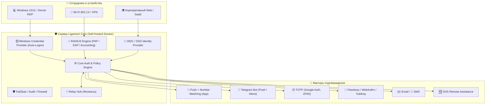

<div align="center">

# 🛡️ Ligament Enterprise MFA & 2FA Platform

**Автономная многофакторная аутентификация корпоративного уровня на вашей инфраструктуре**

[](https://github.com/aligorov/ligament-apps/releases)
[](https://hub.docker.com/r/aligorov/ligament_2fa)
[]()
[]()
[]()
[]()

[Возможности](#-ключевые-возможности) •
[Архитектура](#-архитектура-решения) •
[Тарифы и сравнение](#-тарифы-и-сравнение-редакций) •
[Как купить (USDT)](#-как-купить-лицензию) •
[Быстрый старт](#-быстрый-старт-за-2-минуты) •
[Клиенты и приложения](#-клиентские-приложения) •
[Контакты](#-контакты)

---

</div>

## 📌 О проекте

**Ligament** (от лат. *связка*) — это независимая, полностью локальная (On-Premise / Self-Hosted) система двухфакторной и многофакторной аутентификации (MFA / 2FA). 

Платформа связывает воедино всю вашу ИТ-инфраструктуру:
- 🖥️ **Рабочие станции и серверы Windows (RDP / Консоль)**
- 🌐 **Сетевое оборудование и VPN (MikroTik, Cisco, Fortinet, UniFi, OpenVPN, WireGuard)**
- 🔑 **Корпоративные веб-сервисы через единую точку входа (Single Sign-On / OpenID Connect)**
- 🏢 **Периферийные филиалы и микро-ЦОД через узлы Ligament Relay**
- 📱 **Мобильные и десктопные устройства сотрудников (iOS, Android, Windows, macOS, Linux)**

> 🔒 **Секреты не покидают ваш контур.** Все базы данных, пользователи, токены, журналы аудита и мастер-ключи шифрования хранятся строго на ваших серверах. Платформа не зависит от зарубежных облачных провайдеров и стабильно работает даже в изолированных сетях без доступа в интернет (Air-Gapped).

---

## 🚀 Ключевые возможности



### 1. 🪟 Windows Logon & RDP 2FA (Credential Provider)
- **Нативный тайл входа**: интеграция в экран блокировки и входа Windows (LogonUI) для физических консолей и терминальных RDP-сессий.
- **⚡ Мгновенный Auto-Logon**: сразу после подтверждения входа на смартфоне (в приложении или Telegram) Windows **автоматически выполняет вход в систему** — пользователю больше не нужно вручную нажимать стрелку или Enter.
- **🔢 Number Matching (контрольное число)**: защита от атак типа Push Bombing / Push Fatigue. Случайное контрольное число отображается на экране входа RDP, и пользователь подтверждает вход, вводя именно его в приложении.
- **🔑 FIDO2 / Passkeys на экране входа**: сканирование динамического QR-кода камерой телефона (вход по Face ID / Touch ID) либо прикосновение к аппаратному ключу YubiKey прямо на экране входа Windows.
- **Политики Fail-Open / Fail-Close**: настройка поведения при аварии сети (запретить вход или пропустить по паролю).
- **Экстренный обход (Bypass)**: белый список аварийных учётных записей администратора (Break-Glass Accounts).
- **Централизованное развёртывание**: готовый тихий MSI-установщик и шаблоны групповых политик (GPO / ADMX).

### 2. 📡 Сетевой RADIUS-сервер
- **Широкая поддержка протоколов**: PAP, EAP-TTLS/PAP, PEAP/MS-CHAPv2, RADIUS Accounting.
- **Совместимость с любым оборудованием**: MikroTik RouterOS, Cisco ASA / IOS, Fortinet FortiGate, Ubiquiti UniFi, Check Point, Huawei, Keenetic.
- **Корпоративный Wi-Fi (802.1X)**: WPA2/WPA3 Enterprise для безопасного подключения устройств сотрудников.
- **VPN шлюзы**: L2TP/IPsec, SSTP, OpenVPN, IKEv2, PPPoE.
- **⏳ Push-удержание (Push Holding)**: сервер удерживает RADIUS-сессию, пока сотрудник подтверждает запрос на смартфоне.
- **Окно доверия устройств (Device Trust Window)**: после успешного 2FA повторные подключения с того же устройства не требуют ввода второго фактора в течение заданного окна (например, 8 часов или 7 дней).
- **Vendor-Specific Attributes (VSA)**: динамическая передача групп доступа и параметров маршрутизации в сетевое оборудование.

### 3. 🔑 Single Sign-On (OIDC / SSO IdP)
- **Встроенный OpenID Connect Provider**: полноценный IdP без необходимости разворачивать тяжеловесный Keycloak.
- **Стандарты**: Discovery (`/.well-known/openid-configuration`), JWKS (RS256), PKCE (RFC 7636) для мобильных и SPA-клиентов.
- **Каталог приложений**: панель быстрого запуска (Launchpad) и настраиваемый экран согласия (Consent screen).
- **Интеграция**: готовая защита для Nextcloud, GitLab, 1С:Предприятие, Proxmox VE, Grafana, Portainer, Zabbix, BookStack и любых SaaS/веб-систем.

### 4. ⚡ Периферийные узлы Ligament Relay
- **Филиальная архитектура**: узлы Relay устанавливаются в удалённых офисах, филиалах или изолированных DMZ.
- **Офлайн-устойчивость**: локальная аутентификация и кэширование при обрыве связи с центральным офисом.
- **Безопасный туннель**: защищённое постоянное WebSocket-соединение с автоматическим шифрованием и синхронизацией учётных записей.

### 5. 📲 Полный спектр факторов аутентификации
| Фактор | Описание | Особенности |
|---|---|---|
| **Push в приложение** | Уведомление в мобильный/десктопный клиент | Ввод контрольного числа, биометрия, Zero-Trust геолокация |
| **Telegram-бот** | Интерактивные кнопки в мессенджере | Мгновенный отклик, экстренная кнопка «❌ Это не я!» с красным алертом 🚨 |
| **Passkeys / WebAuthn** | FIDO2 / Passkeys / биометрия | Беспарольный вход, защита от фишинга, YubiKey / Windows Hello / Face ID |
| **TOTP-коды** | Генераторы одноразовых кодов (RFC 6238) | Совместим с Google Authenticator, Яндекс Ключ, 2FAS, Microsoft Auth |
| **Резервные коды** | Одноразовые скретч-коды | Для восстановления доступа при утере основного устройства |
| **Email & SMS** | Доставка кодов на почту и телефон | Пресеты популярных SMS-шлюзов, настраиваемые мультиязычные шаблоны |

### 6. 🆘 Встроенная поддержка (SOS Remote Assistance)
- Кнопка вызова помощи прямо на экране входа (если пользователь потерял телефон или заблокирован).
- Защита от социальной инженерии: подключение инженера только по контрольному коду с экрана заявителя.
- WebRTC-просмотр экрана (view-only), чат и обмен файлами прямо через браузер оператора без установки сторонних программ (AnyDesk / TeamViewer).

### 7. 🛡️ Безопасность и соответствие
- **Криптография**: Argon2id для паролей, AES-256-GCM с AAD для секретов, Ed25519 для лицензий, постоянное время сравнения (Constant-Time) против атак по времени.
- **Встроенный файрвол и Fail2ban**: ограничение частоты запросов (Rate Limiting), черные и белые списки IP/подсетей, временная блокировка при переборе паролей.
- **Обязательная настройка 2FA (Mandatory 2FA Policy)**: принудительный онбординг пользователей с блокировкой удаления единственного второго фактора.
- **Мультиязычность**: интерфейс адаптируется под язык ОС пользователя (8 языков: Русский, English, Deutsch, Français, Español, Português, Türkçe, 中文).

---

## 📊 Тарифы и сравнение редакций

Ligament предлагает прозрачную ценовую модель без скрытых платежей:

| Возможность / Параметр | 🟢 Free (Бесплатно) | 🟡 Demo (Триал) | 🔵 Подписка (Subscription) | 🟣 Бессрочная (Perpetual) |
|---|---|---|---|---|
| **Стоимость** | **0 $ (навсегда)** | **0 $ (30 дней)** | **1 $** / пользователь в месяц | **2.5 $** / пользователь единовременно |
| **Лимит пользователей** | До **5 пользователей** | **Без ограничений** | Согласно купленному пакету | Согласно купленному пакету |
| **Срок действия** | Бессрочно | 30 дней | **3, 6 или 13 месяцев** | **Бессрочно (навсегда)** |
| **Узлы Ligament Relay** | ❌ 0 шт | ✅ Включены | **200 $** / узел на период | **500 $** / узел единовременно |
| **Все факторы 2FA (Push, TOTP, Passkeys, TG)** | ✅ Да | ✅ Да | ✅ Да | ✅ Да |
| **Windows Credential Provider (RDP + Auto-Logon)** | ✅ Да (до 5 польз.) | ✅ Да (без ограничений) | ✅ Да | ✅ Да |
| **RADIUS Сервер (Wi-Fi 802.1X + VPN)** | ✅ Да | ✅ Да | ✅ Да | ✅ Да |
| **OIDC / SSO Identity Provider** | ✅ Да | ✅ Да | ✅ Да | ✅ Да |
| **Web-кабинет и Панель администрирования** | ✅ Да | ✅ Да | ✅ Да | ✅ Да |
| **Fail2ban, Файрвол и Журнал аудита** | ✅ Да | ✅ Да | ✅ Да | ✅ Да |
| **Консоль удаленной помощи (SOS / WebRTC)** | ✅ Да | ✅ Да | ✅ Да | ✅ Да |
| **Обновления версий и поддержка** | Сообщество | На период триала | ✅ Включены в подписку | ✅ Базовые обновления |

### 🟢 Бесплатная редакция (Free)
- **Идеально для**: домашних лабораторий, микробизнеса, тестирования и защиты ключевых администраторов.
- До **5 активных пользователей** навсегда без ограничений по времени.
- Включены все основные протоколы и факторы: RADIUS, Windows RDP CP, TOTP, Telegram, Passkeys, OIDC.
- Доступна сразу после запуска контейнера без ввода ключей и без регистрации.

### 🟡 Демо-режим (Trial — 30 дней)
- **Идеально для**: пилотных внедрений в компаниях любого масштаба.
- Активируется **автоматически** при первом запуске сервера.
- **Полный функционал без ограничений по числу пользователей**.
- По истечении 30 дней сервер мягко переходит в Free-режим (5 пользователей), не прерывая аутентификацию существующих пользователей.

### 🔵 Подписка (Subscription)
- **1 $ за пользователя в месяц**.
- Варианты периодов: **3 месяца**, **6 месяцев** или **13 месяцев** (при годовом заказе 13-й месяц предоставляется в подарок!).
- Периферийный узел Relay: **200 $** за штуку на срок действия подписки.
- Включает все мажорные и минорные обновления версий, новые возможности и техническую поддержку.

### 🟣 Бессрочная лицензия (Lifetime / Perpetual On-Premise)
- **2.5 $ за пользователя (разовый платёж навсегда)**.
- Периферийный узел Relay: **500 $** за штуку (разовый платёж навсегда).
- Лицензия не имеет срока окончания — ваша организация владеет решением бессрочно в полностью изолированном контуре.

---

## 💳 Как купить лицензию

Приобретение коммерческой лицензии выполняется быстро и безопасно через криптовалюту USDT:

### 1. Расчёт стоимости
- **Пример 1 (Подписка на 6 месяцев, 50 пользователей)**:  
  `50 пользователей × 1$ × 6 месяцев = 300 USDT`
- **Пример 2 (Подписка на 13 месяцев, 100 пользователей + 1 Relay)**:  
  `100 пользователей × 1$ × 12 месяцев (13-й месяц в подарок!) + 200$ (Relay) = 1 400 USDT`
- **Пример 3 (Бессрочная лицензия, 200 пользователей + 2 Relay)**:  
  `200 пользователей × 2.5$ + 2 × 500$ (Relay) = 1 500 USDT`

### 2. Реквизиты для оплаты (USDT TRC-20)
Отправьте рассчитанную сумму на официальный кошелёк проекта:

```text
Сеть:    TRON (TRC-20)
Монета:  USDT
Адрес:   THGqs6iB1T4MyL9NC3TKqJkphFGBj4i6uR
```

### 3. Отправка заявки на выдачу лицензии
Сразу после перевода отправьте письмо на адрес:
📧 **[admin@ligam.org](mailto:admin@ligam.org)**

В письме укажите:
1. **Хеш транзакции (TXID)** перевода USDT.
2. **Тип лицензии**: Подписка (3 / 6 / 13 мес) или Бессрочная (Perpetual).
3. **Количество пользователей** и количество узлов **Relay**.
4. **Код активации сервера (Activation Code / Hardware ID)**:
   > Отображается в веб-панели сервера в разделе:  
   > **/admin → 🔑 Лицензия → Код активации текущего хоста** (например, `LG-94A2-B7C1-...`).
5. Название вашей организации или контактное имя.

### 4. Мгновенная офлайн-активация
В ответном письме вы получите криптографически подписанный лицензионный блок (`-----BEGIN LIGAMENT LICENSE----- ...`).
- Откройте **/admin → Лицензия**, вставьте полученный текст и нажмите **«Сохранить лицензию»**.
- Лицензия активируется мгновенно без перезапуска контейнера и без выхода в интернет.

---

## ⚡ Быстрый старт за 2 минуты

Клиенту не требуются исходные коды — только Docker:

### 1. Скачайте `docker-compose.yml`
```bash
mkdir -p ligament && cd ligament
curl -fsSL https://raw.githubusercontent.com/aligorov/ligament/main/docker-compose.yml -o docker-compose.yml
```

### 2. Запустите стек с надёжным паролем БД
```bash
TWOFA_PG_PASSWORD="УкажитеСвойНадежныйПароль123" docker compose up -d
```

### 3. Получите первичный пароль администратора
При первом старте система генерирует случайный пароль администратора `admin`:
```bash
docker cp $(docker compose ps -q twofa):/home/nonroot/admin_password.txt .
cat admin_password.txt
```

### 4. Вход в панель управления
- Откройте в браузере: **http://IP-вашего-сервера:8080**
- Логин: `admin`
- Пароль: из файла `admin_password.txt`
- Перейдите в **/admin → Настройки**, настройте Telegram-бота, почту SMTP и активируйте 2FA для своей учётной записи.

---

## 📱 Клиентские приложения

Официальные клиентские сборки и установщики публикуются в репозитории [**ligament-apps/releases**](https://github.com/aligorov/ligament-apps/releases):

| Компонент | Платформа | Формат | Описание |
|---|---|---|---|
| **Windows Credential Provider** | Windows 10, 11, Server 2016-2025 | `.msi`, `.zip` | Модуль для LogonUI: 2FA на экране входа RDP/консоли с Auto-Logon |
| **Ligament Authenticator** | Android | `.apk` | Мобильное приложение с Push, контрольным числом и биометрией |
| **Ligament Authenticator** | Windows | `.exe` / `.zip` | Десктопный клиент в системном трее с мгновенными уведомлениями |
| **Ligament Authenticator** | macOS | `.dmg` | Нативное приложение для Apple Silicon и Intel |
| **Ligament Authenticator** | Linux | `.tar.gz` | Графический клиент для Linux-десктопов |

---

## 📄 Документация и материалы

- 📊 **Презентация продукта (PDF)**: [`presentation/Ligament-MFA-Обзор-и-сравнение-v2.pdf`](presentation/Ligament-MFA-Обзор-и-сравнение-v2.pdf) — подробный 15-слайдовый отчёт с архитектурой и сравнением с аналогами.
- 🌐 **Интерактивная HTML-презентация**: [`presentation/ligament-presentation-v2.html`](presentation/ligament-presentation-v2.html).
- 🧩 **Клиентский репозиторий**: [aligorov/ligament-apps](https://github.com/aligorov/ligament-apps).

---

## 📬 Контакты

- 📧 **Отдел лицензирования и продаж**: [admin@ligam.org](mailto:admin@ligam.org)
- 🌐 **Официальный портал**: [ligam.org](https://ligam.org)
- 💬 **Техническая поддержка**: [admin@ligam.org](mailto:admin@ligam.org)
- 💰 **Оплата USDT (TRC-20)**: `THGqs6iB1T4MyL9NC3TKqJkphFGBj4i6uR`

<div align="center">
  <sub>© 2026 Ligament Security. Все права защищены. Self-hosted Enterprise MFA.</sub>
</div>
