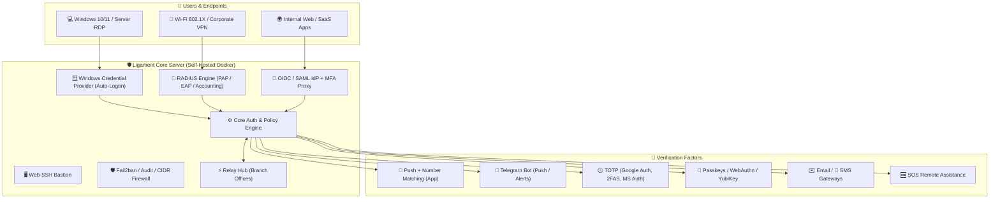

<div align="center">

# 🛡️ Ligament Enterprise MFA & 2FA Platform

**Autonomous on-premise multi-factor authentication for enterprise infrastructure**

[](https://github.com/aligorov/ligament-apps/releases)
[](https://hub.docker.com/r/aligorov/ligament_2fa)
[]()
[]()
[]()
[]()

**English** • [Русский](README.ru.md)

[Features](#-key-capabilities) •
[Architecture](#-architecture) •
[Plans & Comparison](#-pricing--editions-comparison) •
[Free vs Demo](#-detailed-free-vs-demo-breakdown) •
[How to Buy (USDT)](#-how-to-buy-a-license) •
[Quick Start](#-quick-start-in-2-minutes) •
[Client Apps](#-client-applications) •
[Contacts](#-contacts)

---

</div>

## 📌 Overview

**Ligament** (*ligamentum*, Latin for "connecting band") is an independent, completely self-hosted (On-Premise) multi-factor authentication (MFA / 2FA) platform designed for mission-critical corporate environments.

Ligament seamlessly unifies your entire IT infrastructure under a single security umbrella:
- 🖥️ **Windows Workstations & Servers (RDP / Physical Console with native Auto-Logon)**
- 🌐 **Network Infrastructure & VPNs (MikroTik, Cisco, Fortinet, UniFi, OpenVPN, WireGuard)**
- 🔑 **Internal Web Applications via Single Sign-On (OpenID Connect IdP)**
- 🏢 **Branch Offices and Isolated Subnets via Ligament Relay Nodes**
- 📱 **Employee Workstations & Mobile Devices (iOS, Android, Windows, macOS, Linux)**

> 🔒 **Secrets never leave your perimeter.** All databases, user credentials, secrets, audit logs, and master encryption keys remain exclusively on your dedicated servers. The platform has zero dependencies on external cloud vendors and operates reliably even in air-gapped environments without internet access.

---

## 🚀 Key Capabilities



### 1. 🪟 Windows Logon & RDP 2FA (Credential Provider)
- **Native Logon Tile**: Direct integration into Windows LogonUI for console and Remote Desktop (RDP) sessions on Windows 10, 11, and Windows Server 2016–2025.
- **⚡ Instant Auto-Logon**: As soon as the user approves the 2FA prompt on their smartphone (in the app or Telegram), Windows **automatically completes the login** — no need to click the arrow button or press Enter.
- **🔢 Number Matching**: Protection against Push Bombing and Push Fatigue attacks. A verification number is displayed on the Windows RDP login tile, and the user must type or match this exact number in the mobile app.
- **🔑 FIDO2 / Passkeys on Login Screen**: Scan a dynamic QR code on the login tile with a mobile camera (biometric Face ID / Touch ID) or tap a hardware YubiKey directly at the Windows login screen.
- **Fail-Open / Fail-Close Policies**: Configure whether users should be blocked or allowed with password-only if the 2FA server becomes unreachable over the network.
- **Emergency Bypass Whitelist**: Configurable break-glass local accounts to ensure administrators never get locked out.
- **Enterprise Deployment**: Silent MSI installer with `SERVERURL` parameter and Active Directory Group Policy (GPO / ADMX) administrative templates.

### 2. 📡 Enterprise Network RADIUS Server
- **Protocol Support**: PAP, EAP-TTLS/PAP, PEAP/MS-CHAPv2, RADIUS Accounting.
- **Universal Hardware Compatibility**: MikroTik RouterOS, Cisco ASA / IOS, Fortinet FortiGate, Ubiquiti UniFi, Check Point, Huawei, Keenetic.
- **Corporate Wi-Fi (802.1X)**: WPA2/WPA3 Enterprise for secure authentication of corporate laptops and mobile devices.
- **VPN Gateways**: L2TP/IPsec, SSTP, OpenVPN, IKEv2, WireGuard, PPPoE.
- **⏳ Push Holding**: RADIUS engine holds the challenge session while the user responds to the push request on their phone.
- **Device Trust Window** *(Demo & Commercial)*: Configurable grace period (e.g. 8 hours or 7 days) during which verified devices can reconnect without re-prompting for 2FA.
- **Vendor-Specific Attributes (VSA)**: Dynamic authorization and group attribute assignment for network access control.

### 3. 🔑 Single Sign-On (OIDC + SAML IdP) & MFA Proxy *(Demo & Commercial)*
- **Built-in OpenID Connect Provider**: Complete identity provider capabilities without requiring a heavyweight external Keycloak instance.
- **Built-in SAML 2.0 IdP**: Sign internal apps with RSA-SHA256 assertions (POST-binding) — for services without OIDC support.
- **MFA Proxy (forward-auth)**: Protect **any** web service in one line — nginx `auth_request` / Traefik `forwardAuth` call Ligament, authenticated users get `X-Auth-User`/`X-Auth-Role` headers, guests are redirected to login. Your existing apps get MFA without code changes.
- **Standards Compliant**: Discovery (`/.well-known/openid-configuration`), JWKS (RS256), PKCE (RFC 7636) for mobile and single-page apps.
- **Application Catalog**: Built-in Launchpad portal and user consent screens.
- **Seamless Integration**: Ready-to-use protection for Nextcloud, GitLab, 1C:Enterprise, Proxmox VE, Grafana, Portainer, Zabbix, BookStack, and custom enterprise web portals.

### 4. ⚡ Branch Office Nodes (Ligament Relay) *(Demo & Commercial)*
- **Branch Architecture**: Deploy lightweight Relay agents to remote offices, satellite branches, or isolated DMZ zones.
- **Offline Resilience**: Local authentication cache preserves login capabilities during WAN or internet outages.
- **Encrypted Tunnels**: Persistent, encrypted WebSocket connection with automated user credential sync.

### 5. 📲 Full Spectrum of Verification Factors
| Factor | Description | Highlights |
|---|---|---|
| **App Push** | Push notification to mobile/desktop app | Number matching, biometric unlock, Zero-Trust metadata |
| **Telegram Bot** | Interactive inline buttons in Telegram | Instant delivery, emergency «❌ Not Me!» button with red alert 🚨 |
| **Passkeys / WebAuthn** | FIDO2 / Passkeys / WebAuthn | Phishing-resistant, hardware YubiKey, Windows Hello, Face ID |
| **TOTP Codes** | Time-based OTP generator (RFC 6238) | Google Authenticator, 2FAS, Microsoft Authenticator, Yandex Key |
| **Backup Codes** | One-time scratch recovery codes | Emergency access recovery if primary device is unavailable |
| **Email & SMS** | One-time codes delivered via email or SMS | Configurable multi-language templates, pre-configured SMS gateways |
| **Voice Calls (TTS)** | Code delivered by phone call | For users without smartphones / poor eyesight |
| **HOTP** | Counter-based OTP (RFC 4226) | Hardware tokens and desktop authenticators |
| **PWA Authenticator** | Browser app `/app` — install to Home Screen | Web Push on iOS (no App Store needed), TOTP, passkeys, SOS |
| **Corporate messengers** | eXpress, MAX, VK Teams, Slack, Mattermost, Discord, VK | Approval buttons + full self-service cabinet via `/menu` (devices, sessions, history) |

### 6. 🆘 Integrated Remote Assistance (SOS Console) *(Demo & Commercial)*
- Direct help request button located directly on the Windows login screen (accessible without logging in).
- Social engineering defense: Remote engineer connects only by matching a one-time visual code displayed on the user's screen.
- Browser-based WebRTC screen viewing (view-only), chat, and file exchange without third-party software (AnyDesk, TeamViewer).

### 7. 🖥️ Web-SSH Bastion *(Demo & Commercial)*
- Admins/operators connect to network equipment and servers **through the browser** — Ligament becomes the single entry point: SSO of Ligament itself + 2FA, per-user ACL to targets, host-key TOFU pinning.
- Session recording (output-only), 30-second access re-validation, brute-force limits per user+target. No VPN/jump-host software for engineers — just a browser.

### 8. 🛡️ Security Hardening, Roles & Monitoring
- **Cryptographic Primitives**: Argon2id for password hashing, AES-256-GCM with AAD for database secrets, Ed25519 for license signatures, constant-time comparisons.
- **Built-in CIDR Firewall & Fail2ban**: IP rate limiting, CIDR whitelists/blacklists, automatic temporary bans on brute-force attempts.
- **Adaptive Policies**: per-group required/denied factors (e.g. «admins — passkey only»), time windows («office hours»), Geo-IP allow/deny lists.
- **Roles & API Tokens**: admin / operator / auditor; API tokens with fine-grained scopes. **Impersonation** with audit trail and one-time **break-glass** recovery codes.
- **Monitoring**: Prometheus `/metrics`, health endpoint with build version, SIEM connector, event webhooks; admin notifications (license/expiring certs/fail spikes).
- **Compliance-ready Audit**: immutable log, CSV export, printable **incident report** (timeline + summary) for regulators/ISB.
- **Mandatory 2FA Policy**: Forced user onboarding preventing users from bypassing or deleting their only 2FA factor.
- **Multi-language Support**: Automatic adaptation to the client's OS locale (8 languages: English, Russian, German, French, Spanish, Portuguese, Turkish, Chinese).
- **Cryptographic Primitives**: Argon2id for password hashing, AES-256-GCM with AAD for database secrets, Ed25519 for license signatures, constant-time comparisons.
- **Built-in CIDR Firewall & Fail2ban**: IP rate limiting, CIDR whitelists/blacklists, automatic temporary bans on brute-force attempts.
- **Mandatory 2FA Policy**: Forced user onboarding preventing users from bypassing or deleting their only 2FA factor.
- **Multi-language Support**: Automatic adaptation to the client's OS locale (8 languages: English, Russian, German, French, Spanish, Portuguese, Turkish, Chinese).

---

## 📊 Pricing & Editions Comparison

| Feature / Parameter | 🟢 Free (Forever) | 🟡 Demo (30-Day Trial) | 🔵 Subscription | 🟣 Perpetual (Lifetime) |
|---|---|---|---|---|
| **Price** | **$0 (forever)** | **$0 (30 days)** | **$1** / user / month | **$2.5** / user one-time |
| **Active User Limit** | Up to **5 users** | **Unlimited** | Per purchased seats | Per purchased seats |
| **License Duration** | Lifetime | 30 days from launch | **3, 6, or 13 months** | **Lifetime (forever)** |
| **Branch Office Nodes (Ligament Relay)** | ❌ **0 nodes (locked)** | ✅ **Included (unlimited)** | **$200** / node / term | **$500** / node one-time |
| **Windows Credential Provider (RDP + Auto-Logon)** | ✅ Yes (up to 5 users) | ✅ Yes (unlimited) | ✅ Yes | ✅ Yes |
| **Number Matching + QR Passkeys on Tile** | ✅ Yes | ✅ Yes | ✅ Yes | ✅ Yes |
| **All Factors: Push, TOTP, Telegram, Passkeys, YubiKey** | ✅ Yes | ✅ Yes | ✅ Yes | ✅ Yes |
| **Backup Codes, Email & SMS Gateways** | ✅ Yes | ✅ Yes | ✅ Yes | ✅ Yes |
| **RADIUS Server (Wi-Fi 802.1X + VPN)** | ✅ Yes (standard 2FA) | ✅ Yes (full) | ✅ Yes (full) | ✅ Yes (full) |
| **Device Trust Window in RADIUS (`trust`)** | ❌ No (2FA on every login) | ✅ Yes (up to N days/hours) | ✅ Yes | ✅ Yes |
| **Single Sign-On (OIDC IdP) (`sso`)** | ❌ No (403 Forbidden) | ✅ Yes (unlimited) | ✅ Yes | ✅ Yes |
| **Active Directory / LDAP Sync (`ldap`)** | ❌ No (403 Forbidden) | ✅ Yes | ✅ Yes | ✅ Yes |
| **Branch Relay Offline Nodes (`relay`)** | ❌ No (0 nodes allowed) | ✅ Yes (unlimited trial) | **$200** / node / term | **$500** / node one-time |
| **Web-SSH Bastion (`bastion`)** | ❌ No | ✅ Yes | ✅ Yes | ✅ Yes |
| **SAML IdP + SIEM connector (`siem`)** | ❌ No | ✅ Yes | ✅ Yes | ✅ Yes |
| **SOS Remote Assistance / WebRTC (`support`)** | ❌ No (403 Forbidden) | ✅ Yes | ✅ Yes | ✅ Yes |
| **Company Branding & White-Label (`white-label`)** | ❌ No | ✅ Yes | ✅ Yes | ✅ Yes |
| **Fail2ban, CIDR Firewall & Audit Logs** | ✅ Yes | ✅ Yes | ✅ Yes | ✅ Yes |
| **User Self-Service Portal (`/me`)** | ✅ Yes | ✅ Yes | ✅ Yes | ✅ Yes |
| **Version Updates & Vendor Support** | Community | Full trial support | ✅ Included in subscription | ✅ Base version updates |

---

### 🥊 Competitor Comparison

| Capability | 🛡️ **Ligament** | Multifactor | IDEA MFA | ViPNet IAS | UserGate MFA |
|---|---|---|---|---|---|
| **Architecture** | **100% Self-Hosted (1 Docker)** | Hybrid (Vendor Cloud + On-Prem) | On-Prem / Cloud | On-Prem | On-Prem (UserGate hardware) |
| **Free Tier** | **Up to 5 users forever** | None (Trial only) | None (Trial only) | None | None |
| **Windows RDP 2FA** | **Yes (Auto-Logon + QR)** | Yes (Manual click) | Yes | Ecosystem components | Limited |
| **Number Matching on Tile** | **Yes (Direct on screen)** | Yes | Yes | Yes | Yes |
| **Branch Office Relay (Offline Cache)** | **Yes (Ligament Relay)** | Partial (Cloud required) | Yes (Distributed) | Yes (Complex PKI) | Central cluster only |
| **Push + Telegram Bot** | **Yes (Both native)** | Yes (Telegram/App) | Yes | Yes | Yes |
| **FIDO2 / Passkeys / YubiKey** | **Yes (Web & Windows Tile)** | Yes | Yes | Yes | Partial |
| **Built-in OIDC SSO IdP** | **Yes (Self-Hosted in core)** | Cloud-mediated | Yes | Yes | Via platform |
| **RADIUS + Device Trust** | **Yes (Per-user/group)** | Radius Adapter | Yes | Yes | Yes |
| **Integrated SOS Support Console** | **Yes (WebRTC on login tile)** | None | None | None | None |
| **Multi-Language Support** | **8 languages out-of-the-box** | RU / EN | RU | RU | RU |

---

## 🔍 Detailed Free vs Demo Breakdown

### 🟢 What is included in the Free Version (Forever):
> The Free edition is designed for homelabs, micro-teams, and protecting critical administrator accounts (strictly **up to 5 users**):

1. **Windows Workstation & Server Protection**:
   - Full Windows Credential Provider (Windows 10/11 & Windows Server RDP/Local).
   - **Auto-Logon** capability (instant Windows login upon approval on mobile).
   - **Number Matching** on the RDP tile against Push Bombing attacks.
   - **Passkeys / QR code** login and **YubiKey** hardware tokens.
   - Emergency break-glass bypass accounts and Fail-Open / Fail-Close policies.
2. **All Core 2FA Factors**:
   - Push notifications to Ligament Authenticator.
   - Telegram bot (codes, interactive approval buttons, instant fraud alerts).
   - TOTP authenticators (Google Authenticator, 2FAS, Microsoft Authenticator, etc.).
   - Emergency backup recovery codes.
   - Email (SMTP) and SMS one-time password delivery.
3. **Core RADIUS Server**:
   - VPN and Wi-Fi authentication (PAP, EAP-TTLS, PEAP).
   - Push session holding.
   - *Free edition note*: Device trust window (`trust`) is disabled — 2FA is required on every connection.
4. **Administration & Security**:
   - Web administration console and user self-service portal (`/me`).
   - Integrated CIDR firewall and Fail2ban brute-force protection.
   - Immutable audit log of all authentication attempts and administrative actions.
   - Database backup export and import.

### 🚫 What is gated in Free (Unlocked in Demo & Commercial):
- 🔒 **OIDC / SSO Identity Provider (`sso`)**: External web apps cannot use Ligament as an SSO IdP (OIDC endpoints return `403 feature_not_licensed`).
- 🔒 **Active Directory / LDAP Sync (`ldap`)**: Automated directory synchronization and AD password verification are disabled.
- 🔒 **RADIUS Device Trust Window (`trust`)**: Verified devices cannot skip 2FA for N days/hours.
- 🔒 **SOS Remote Assistance (`support`)**: Remote WebRTC assistance console on the login screen is disabled.
- 🔒 **Branch Relay Nodes (`relay`)**: Remote branch office nodes are blocked (0 nodes permitted).
- 🔒 **White-Label (`white-label`)**: Vendor branding cannot be customized.
- 🔒 **User Capacity**: Strictly limited to 5 active users.

### 🟡 What is included in the 30-Day Demo (Trial):
- Automatically activated on **first launch** without requiring license keys or vendor registration.
- **100% of Enterprise features unlocked**: OIDC SSO, Active Directory Sync, Device Trust Windows, SOS Assistance, Relay Nodes, and White-Labeling.
- **Unlimited Users**: Test across your entire network with 100, 500, or 1000+ employees.
- **Graceful degradation**: After 30 days, the server automatically transitions to Free mode (5 users). Existing logins **are never abruptly blocked**, while adding users beyond 5 requires a license.

---

## 💳 How to Buy a License

Commercial licenses are purchased transparently and securely using USDT cryptocurrency:

### 1. Pricing Formula
- **Subscription**: `$1 × [User Count] × [Term: 3, 6, or 13 months] + [$200 × Relay Count]`  
  *(Annual orders receive the 13th month completely free!)*
- **Perpetual (Lifetime)**: `$2.5 × [User Count] + [$500 × Relay Count]` (one-time payment forever).

#### Calculation Examples:
- **50 users for 6 months**: `50 × $1 × 6 = 300 USDT`
- **100 users for 13 months + 1 Relay**: `100 × $1 × 12 mo + $200 = 1,400 USDT`
- **200 users Perpetual (Lifetime) + 2 Relays**: `200 × $2.5 + 2 × $500 = 1,500 USDT`

### 2. Payment Details (USDT TRC-20)
Send the exact calculated amount to the official project wallet:

```text
Network:   TRON (TRC-20)
Currency:  USDT
Address:   THGqs6iB1T4MyL9NC3TKqJkphFGBj4i6uR
```

### 3. Submit License Request
After completing the transfer, send an email to:  
📧 **[admin@ligam.org](mailto:admin@ligam.org)**

Please include:
1. **Transaction Hash (TXID)** of the USDT payment.
2. **License Plan**: Subscription (3, 6, or 13 months) or Perpetual (Lifetime).
3. **Number of Users** and number of **Relay nodes**.
4. **Server Activation Code (Hardware ID)**:
   > Found in your server's web admin console:  
   > **/admin → 🔑 License → Current Host Activation Code** (e.g. `LG-94A2-B7C1-...`).
5. Your company name or contact person.

### 4. Instant Offline Activation
You will receive a cryptographically signed license file (`-----BEGIN LIGAMENT LICENSE----- ...`) in reply.
- Go to **/admin → License**, paste the text, and click **«Save License»**.
- The license takes effect immediately without container restart and without internet access.

---

## ⚡ Quick Start in 2 Minutes

No build tools or source compilation required — everything runs in official Docker containers:

### 1. Download `docker-compose.yml`
```bash
mkdir -p ligament && cd ligament
curl -fsSL https://raw.githubusercontent.com/aligorov/ligament/main/docker-compose.yml -o docker-compose.yml
```

### 2. Launch the Stack with a Strong Database Password
```bash
TWOFA_PG_PASSWORD="YourStrongSecretPassword123" docker compose up -d
```

### 3. Retrieve the Initial Admin Password
On first startup, the server automatically generates a secure administrative password:
```bash
docker cp $(docker compose ps -q twofa):/home/nonroot/admin_password.txt .
cat admin_password.txt
```

### 4. Access the Web Dashboard
- Open in your browser: **http://YOUR-SERVER-IP:8080**
- Username: `admin`
- Password: from `admin_password.txt`
- Navigate to **/admin → Settings** to configure your Telegram bot, SMTP email gateway, and activate 2FA for your account.

---

## 📱 Client Applications

Official client packages and installers are published in the [**ligament-apps/releases**](https://github.com/aligorov/ligament-apps/releases) repository:

| Component | Platform | Format | Purpose |
|---|---|---|---|
| **Windows Credential Provider** | Windows 10, 11, Server 2016–2025 | `.msi`, `.zip` | LogonUI module: RDP/Local 2FA with Auto-Logon |
| **Ligament Relay Agent** | Linux (Docker, Binary), Windows Server | Docker image, `.zip` | Peripheral branch node: offline auth cache & isolated subnet proxy |
| **Ligament Authenticator** | Android | `.apk` | Mobile client with Push, number matching, and biometrics |
| **Ligament Authenticator** | Windows | `.exe`, `.zip` | System tray desktop client with instant push alerts |
| **Ligament Authenticator** | Linux (Astra Linux, RED OS, Alt Linux, Ubuntu, Debian, RHEL) | `.deb`, `.rpm`, `.tar.gz` | Graphical desktop client with push alerts, number matching, and system tray |

### 🐧 Linux Enterprise & Russian OS Deployment

Ligament Authenticator is packaged and verified for major enterprise Linux distributions and Russian operating systems:

| Distribution | Package Type | Architecture | Installation Command |
|---|---|---|---|
| **Astra Linux** (Special Edition 1.7 / CE) | `.deb` | `amd64` | `sudo dpkg -i ligament-authenticator_*.deb || sudo apt-get install -f` |
| **RED OS / РЕД ОС** (7.3, 8) | `.rpm` | `x86_64` | `sudo dnf install ./ligament-authenticator-*.rpm` *(or `sudo rpm -ivh`)* |
| **Alt Linux / Альт Рабочая станция** (p9, p10) | `.rpm` | `x86_64` | `sudo epm install ./ligament-authenticator-*.rpm` *(or `sudo apt-get install ./...`)* |
| **Ubuntu / Debian / Linux Mint** | `.deb` | `amd64` | `sudo apt install ./ligament-authenticator_*.deb` |
| **RHEL / Rocky / AlmaLinux / Fedora** | `.rpm` | `x86_64` | `sudo dnf install ./ligament-authenticator-*.rpm` |
| **Universal Portable (any distro)** | `.tar.gz` | `x86_64` | `tar -xzf Ligament-2FA-Linux-x86_64.tar.gz && sudo ./ligament-authenticator/install.sh` |

> [!TIP]
> All Linux packages automatically create system application launcher entries (`ligament-authenticator.desktop`), install high-resolution icons into `/usr/share/icons/hicolor`, register the `/usr/bin/ligament-authenticator` executable symlink, and support custom protocol handlers (`x-scheme-handler/ligament`). For unprivileged environments, `./install.sh` inside the `.tar.gz` archive can be executed without `sudo` into `~/.local`.

### 🌐 Ligament Relay Deployment (Branch Edge Node)

For remote branch offices and isolated network enclaves requiring offline 2FA autonomy, deploy **Ligament Relay** ([repository aligorov/ligament-relay](https://github.com/aligorov/ligament-relay)):

1. **Download the pre-configured compose manifest**:
   ```bash
   curl -sSL https://raw.githubusercontent.com/aligorov/ligament/main/docker-compose.relay.yml -o docker-compose.yml
   ```
2. **Create `config.yaml`** (connection parameters are generated in the core admin console at `/admin/relays`):
   ```yaml
   core:
     url: "https://2fa.yourdomain.com"
     password: "GeneratedBranchPassword"
   ```
3. **Start the node**:
   ```bash
   docker compose up -d
   ```

---

## 📄 Documentation & Presentation

- 📊 **Product Presentation (PDF)**: [`presentation/Ligament-MFA-Обзор-и-сравнение-v2.pdf`](presentation/Ligament-MFA-Обзор-и-сравнение-v2.pdf) — 15-page analytical overview covering architecture and competitor comparisons.
- 🌐 **Interactive Web Presentation**: [`presentation/ligament-presentation-v2.html`](presentation/ligament-presentation-v2.html).
- 🧩 **Client Applications Repository**: [aligorov/ligament-apps](https://github.com/aligorov/ligament-apps).

---

## 📬 Contacts

- 📧 **Sales & Licensing**: [admin@ligam.org](mailto:admin@ligam.org)
- 🌐 **Official Portal**: [ligam.org](https://ligam.org)
- 💬 **Technical Support**: [admin@ligam.org](mailto:admin@ligam.org)
- 💰 **USDT Payments (TRC-20)**: `THGqs6iB1T4MyL9NC3TKqJkphFGBj4i6uR`

<div align="center">
  <sub>© 2026 Ligament Security. All rights reserved. Self-hosted Enterprise MFA.</sub>
</div>
