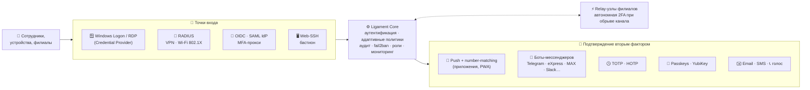

<div align="center">

# 🛡️ Ligament Enterprise MFA & 2FA Platform

**Автономная многофакторная аутентификация корпоративного уровня на вашей инфраструктуре**

[](https://github.com/aligorov/ligament-apps/releases)
[](https://hub.docker.com/r/aligorov/ligament_2fa)
[]()
[]()
[]()
[]()

**Русский** • [English](README.md)

[Возможности](#-ключевые-возможности) •
[Архитектура](#-архитектура-решения) •
[Тарифы и сравнение](#-тарифы-и-сравнение-редакций) •
[Что доступно в Free и Demo](#-детальное-сравнение-free-и-demo) •
[Как купить (USDT)](#-как-купить-лицензию) •
[Быстрый старт](#-быстрый-старт-за-2-минуты) •
[Контакты](#-контакты)

---

</div>

## 📌 О проекте

**Ligament** (от лат. *связка*) — это независимая, полностью локальная (On-Premise / Self-Hosted) система двухфакторной и многофакторной аутентификации (MFA / 2FA). 

Платформа связывает воедино всю вашу корпоративную ИТ-инфраструктуру:
- 🖥️ **Рабочие станции и серверы Windows (RDP / Консоль с нативным Auto-Logon)**
- 🌐 **Сетевое оборудование и VPN (MikroTik, Cisco, Fortinet, UniFi, OpenVPN, WireGuard)**
- 🔑 **Корпоративные веб-сервисы через единую точку входа (Single Sign-On / OpenID Connect)**
- 🏢 **Периферийные филиалы и микро-ЦОД через узлы Ligament Relay**
- 📣 **Уведомления сотрудникам — шлюз уведомлений (Notification Gateway) с верифицированными контактами (мессенджеры, SMS, Email, Голос)**
- 📱 **Мобильные и десктопные устройства сотрудников (iOS, Android, Windows, macOS, Linux)**

> 🔒 **Секреты никогда не покидают ваш контур.** Все базы данных, пользователи, токены, журналы аудита и мастер-ключи шифрования хранятся строго на ваших серверах. Платформа не зависит от зарубежных облачных вендоров и стабильно работает даже в полностью изолированных сетях без доступа в интернет (Air-Gapped).

---

## 🚀 Ключевые возможности



### 1. 🪟 Windows Logon & RDP 2FA (Credential Provider)
- **Нативный модуль входа**: интеграция в экран блокировки и входа Windows (LogonUI) для локальных консолей и терминальных RDP-сессий (Windows 10, 11, Server 2016–2025).
- **⚡ Мгновенный Auto-Logon**: сразу после подтверждения входа на смартфоне (в приложении или Telegram) Windows **автоматически входит в учётную запись** — пользователю больше не нужно вручную кликать стрелку или нажимать Enter.
- **🔢 Number Matching (контрольное число)**: надёжная защита от атак Push Bombing / Push Fatigue. Случайное контрольное число отображается прямо на экране RDP, и пользователь подтверждает вход, вводя именно его в приложении.
- **🔑 FIDO2 / Passkeys на экране входа**: сканирование динамического QR-кода камерой телефона (вход по Face ID / Touch ID) либо касание аппаратного ключа YubiKey прямо на экране входа Windows.
- **Политики Fail-Open / Fail-Close**: настройка поведения при недоступности сервера 2FA (строгая блокировка или временный допуск по паролю).
- **Экстренный обход (Bypass)**: белый список аварийных учётных записей администратора (Break-Glass Accounts).
- **Централизованное развёртывание**: тихий MSI-установщик с параметром `SERVERURL` и шаблоны групповых политик Active Directory (GPO / ADMX).

### 2. 📡 Сетевой RADIUS-сервер
- **Широкая поддержка протоколов**: PAP, EAP-TTLS/PAP, PEAP/MS-CHAPv2, RADIUS Accounting.
- **Совместимость с любым оборудованием**: MikroTik RouterOS, Cisco ASA / IOS, Fortinet FortiGate, Ubiquiti UniFi, Check Point, Huawei, Keenetic.
- **Корпоративный Wi-Fi (802.1X)**: WPA2/WPA3 Enterprise для безопасного подключения личных и корпоративных устройств.
- **VPN шлюзы**: L2TP/IPsec, SSTP, OpenVPN, IKEv2, PPPoE.
- **⏳ Push-удержание (Push Holding)**: RADIUS-сервер удерживает сессию, пока сотрудник подтверждает запрос на смартфоне.
- **Окно доверия устройств (Device Trust Window)** *(в Demo и платных лицензиях)*: после успешного 2FA повторные подключения с того же устройства не требуют повторного подтверждения в течение заданного окна (например, 8 часов или 7 дней).
- **Vendor-Specific Attributes (VSA)**: динамическая передача групп доступа и сетевых атрибутов в оборудование.

### 3. 🔑 Single Sign-On (OIDC + SAML IdP) и MFA-прокси *(в Demo и платных лицензиях)*
- **Встроенный OpenID Connect Provider**: полноценный IdP без необходимости поднимать отдельный Keycloak.
- **Встроенный SAML 2.0 IdP**: подписанные RSA-SHA256 assertion (POST-binding) — для сервисов без поддержки OIDC.
- **MFA-прокси (forward-auth)**: защита **любого** веб-сервиса в одну строку — nginx `auth_request` / Traefik `forwardAuth` обращаются к Ligament, авторизованный получает заголовки `X-Auth-User`/`X-Auth-Role`, гость — редирект на логин. MFA для существующих приложений без изменения их кода.
- **Стандарты**: Discovery (`/.well-known/openid-configuration`), JWKS (RS256), PKCE (RFC 7636) для мобильных и веб-клиентов.
- **Каталог приложений**: панель быстрого запуска (Launchpad) и экран согласия (Consent screen).
- **Интеграция**: готовая защита для Nextcloud, GitLab, 1С:Предприятие, Proxmox VE, Grafana, Portainer, Zabbix, BookStack и любых внутренних веб-порталов.

### 4. ⚡ Периферийные узлы Ligament Relay *(в Demo и платных лицензиях)*
- **Филиальная архитектура**: узлы Relay устанавливаются в удалённых офисах, филиалах или изолированных подсетях.
- **Офлайн-устойчивость**: локальная аутентификация и кэширование при обрыве связи с центральным офисом.
- **Безопасный туннель**: защищённое WebSocket-соединение с автоматическим шифрованием и синхронизацией учётных записей.
- **Туннель для бастиона**: узел Relay проксирует Web-SSH-сессии бастиона к маршрутизаторам и серверам своей локальной сети как зашифрованная «слепая труба» — изолированные сети филиалов доступны ядру без VPN, при этом сам Relay не может читать трафик.

### 5. 📲 Полный спектр факторов аутентификации
| Фактор | Описание | Особенности |
|---|---|---|
| **Push в приложение** | Уведомление в мобильный/десктопный клиент | Ввод контрольного числа, биометрия, Zero-Trust метаданные |
| **Telegram-бот** | Интерактивные кнопки в мессенджере | Мгновенный отклик, экстренная кнопка «❌ Это не я!» с красным алертом 🚨 |
| **Passkeys / WebAuthn** | FIDO2 / Passkeys / биометрия | Беспарольный вход, защита от фишинга, YubiKey / Windows Hello / Face ID |
| **TOTP-коды** | Генераторы одноразовых кодов (RFC 6238) | Совместим с Google Authenticator, Яндекс Ключ, 2FAS, Microsoft Auth |
| **Резервные коды** | Одноразовые скретч-коды | Для восстановления доступа при утере основного устройства |
| **Email & SMS** | Доставка кодов на почту и телефон | Пресеты популярных SMS-шлюзов, настраиваемые шаблоны |
| **Голосовые звонки (TTS)** | Код диктуется телефонным звонком | Для сотрудников без смартфона / при слабом зрении |
| **HOTP** | Коды по счётчику (RFC 4226) | Аппаратные токены и десктоп-аутентификаторы |
| **PWA-аутентификатор** | Браузерное приложение `/app`, установка на «Домашний экран» | Web Push на iOS без App Store, TOTP, passkeys, SOS |
| **Корпоративные мессенджеры** | eXpress, MAX, VK Teams, Slack, Mattermost, Discord, VK | Кнопки подтверждения + полный кабинет самообслуживания `/menu` (устройства, сессии, история) |

### 6. 🆘 Встроенная поддержка (SOS Remote Assistance) *(в Demo и платных лицензиях)*
- Кнопка вызова помощи прямо на экране входа (если пользователь потерял телефон или заблокирован).
- Защита от социальной инженерии: подключение инженера только по контрольному коду с экрана заявителя.
- WebRTC-просмотр экрана (view-only), чат и обмен файлами прямо через браузер оператора без сторонних программ (AnyDesk / TeamViewer).

### 7. 🖥️ Web-SSH бастион *(в Demo и платных лицензиях)*
- Инженеры подключаются к сетевому оборудованию и серверам **прямо из браузера** — Ligament становится единой точкой входа: собственный SSO + 2FA, персональные ACL на цели, закрепление host-ключей (TOFU).
- Запись сессий (только вывод), ревалидация доступа каждые 30 секунд, лимиты подбора на пару «пользователь + цель». Инженерам не нужны VPN и jump-host — только браузер.
- **Сети филиалов через Relay**: цель можно привязать к узлу Relay филиала — SSH-сессии туннелируются через него к оборудованию в изолированных офисных сетях, недоступных из центра напрямую.

### 8. 📣 Шлюз уведомлений и верифицированные контакты *(в Demo и платных лицензиях)*
- **Ligament — поставщик уведомлений для вашей инфраструктуры**: один REST-вызов (`POST /api/v1/notify`) позволяет системам мониторинга, ITSM и бизнес-приложениям доставлять сообщения сотрудникам через каналы, которыми они уже пользуются, — Telegram, eXpress, MAX, VK Teams, Slack, Mattermost, Discord, VK, Email, SMS и голосовой звонок.
- **Верифицированные контакты**: точка доставки привязывается к пользователю только после подтверждения владения (онбординг в боте мессенджера, подтверждённые email/телефон) — через API нельзя отправить сообщение на произвольный адрес, только на верифицированные контакты сотрудника.
- **Согласие пользователя**: каждый сотрудник управляет тем, какие его каналы доступны для уведомлений через шлюз; состояние согласий хранится на сервере.
- **Диспетчер и журнал доставки**: один вызов API расходится веером по всем включённым каналам получателя; каждая попытка доставки фиксируется в неотмываемом журнале уведомлений (кто отправил, кому, по какому каналу, статус доставки) прямо в панели администратора.
- **Безопасность по умолчанию**: работа через API-токены со скоупами, наследование CIDR-файрвола, fail2ban и полного аудиторского следа.

### 9. 🛡️ Безопасность, роли и мониторинг
- **Криптопримитивы**: Argon2id для паролей, AES-256-GCM с AAD для секретов в БД, Ed25519 для лицензий, сравнения за постоянное время.
- **Встроенный CIDR-файрвол и fail2ban**: rate-limit по IP, белые/чёрные списки подсетей, автобаны за перебор.
- **Адаптивные политики**: обязательные/запрещённые факторы по группам («админы — только passkey»), окна времени («рабочие часы»), Geo-IP списки.
- **Роли и API-токены**: admin / operator / auditor; API-токены с точечными скоупами. **Имперсонация** с аудиторским следом и одноразовые **break-glass**-коды восстановления.
- **Мониторинг**: Prometheus `/metrics`, health-эндпоинт с тегом сборки, SIEM-коннектор, вебхуки событий; админ-уведомления (лицензия/сертификаты/всплески неудач).
- **Аудит для комплаенса**: неотмываемый журнал, экспорт CSV, печатный **отчёт по инциденту** (хронология + сводка) для регуляторов/ИБ.
- **Внутренний (LAN) IP**: события входа фиксируют и внешний, и внутренний IP (подсеть офиса) — в уведомлениях о входе, push-карточках, аудите UI/CSV и отчёте по инциденту видно, из какого офиса или сети пришёл сотрудник.
- **Обязательная 2FA**: принудительный онбординг — пользователь не может остаться без единого фактора.
- **Мультиязычность**: автоматическая подстройка под язык ОС клиента (8 языков, включая русский).

---

## 📊 Тарифы и сравнение редакций

### 🧭 Какая редакция вам подойдёт?

| Редакция | Кому | Цена | Пользователи | Срок |
|---|---|---|---|---|
| 🟢 **Free** | Хоумлаб, микрокоманды, защита админских УЗ | **0 $ навсегда** | до 5 | Без ограничений |
| 🟡 **Demo** | Полное тестирование всех Enterprise-функций | 0 $ | Без лимита | 30 дней, с привязкой к железу сервера → плавный переход в Free |
| 🔵 **Подписка** | Промышленная эксплуатация | **1 $** / польз. в месяц | по местам | 3 / 6 / **13 мес (13-й бесплатно)** |
| 🟣 **Бессрочная** | Промышленная эксплуатация, купил один раз | **2.5 $** / польз. единовременно | по местам | Навсегда |

### ✅ Входит в каждую редакцию (даже в Free)

<details open>
<summary><b>Все факторы 2FA, вход в Windows, боты и всё ядро — базовая безопасность без пейволлов</b></summary>

- 📲 **Push с вводом контрольного числа** (мобильные/десктоп-приложения + **PWA с Web Push на iOS**)
- 🔑 **Passkeys / WebAuthn / YubiKey**, TOTP и HOTP, резервные коды
- ✉️ Доставка кодов **Email / SMS / Голосом (TTS)**, боты корпоративных мессенджеров (Telegram, eXpress, MAX, VK Teams, Slack, Mattermost, Discord, VK) с кабинетом самообслуживания `/menu`
- 🪟 **Windows Credential Provider**: вход в RDP и консоль, автологин, QR-passkeys, политики Fail-Open/Close, деплой через GPO/ADMX
- 📡 **RADIUS-сервер**: VPN + Wi-Fi 802.1X (PAP, EAP-TTLS, PEAP), accounting, генератор конфигов MikroTik
- 🛡️ CIDR-файрвол и fail2ban, неотмываемый аудит + экспорт CSV, отчёт по инциденту
- 🔐 **MFA-прокси (forward-auth)** для nginx/Traefik, роли (admin/operator/auditor), API-токены, имперсонация и break-glass
- 📊 Prometheus `/metrics`, health-эндпоинт, вебхуки событий, админ-уведомления

</details>

### 🚀 Enterprise-модули *(открыты в Demo и платных редакциях)*

| Возможность | 🟢 Free | 🟡 Demo | 🔵 Подписка | 🟣 Бессрочная |
|---|:---:|:---:|:---:|:---:|
| **SSO-провайдер идентификации — OIDC + SAML** (`sso`) | ❌ | ✅ | ✅ | ✅ |
| **Синхронизация AD / LDAP** (`ldap`) | ❌ | ✅ | ✅ | ✅ |
| **Окно доверия устройств RADIUS** (`trust`) | ❌ 2FA на каждый вход | ✅ | ✅ | ✅ |
| **Geo-IP-политики доступа** (`geo`) | ❌ | ✅ | ✅ | ✅ |
| **SOS-удалённая помощь** (`support`) | ❌ | ✅ | ✅ | ✅ |
| **Web-SSH бастион** (`bastion`) | ❌ | ✅ | ✅ | ✅ |
| **SIEM-коннектор** (`siem`) | ❌ | ✅ | ✅ | ✅ |
| **Шлюз уведомлений + верифицированные контакты** (`notify`) | ❌ | ✅ | ✅ | ✅ |
| **Фирменный стиль / White-Label** | ❌ | ✅ | ✅ | ✅ |
| **Узлы Relay для филиалов** (`relay`) | ❌ 0 узлов | ✅ без лимита | **200 $** / узел / срок | **500 $** / узел единовременно |

> 💡 **Demo = 100% функций, без лимита пользователей, без регистрации.** Через 30 дней плавно превращается в Free — существующие входы не блокируются.

---

### 🥊 Сравнение с аналогами на рынке РФ

| Критерий / Возможность | 🛡️ **Ligament** | Мультифактор | IDEA MFA | ViPNet IAS | UserGate MFA |
|---|---|---|---|---|---|
| **Развёртывание** | **100% Self-Hosted (1 Docker)** | Гибрид (Облако вендора + On-Prem) | On-Prem / Облако | On-Prem | On-Prem (экосистема UserGate) |
| **Бесплатный режим** | **До 5 пользователей навсегда** | Нет (только триал) | Нет (только триал) | Нет | Нет |
| **Windows RDP 2FA** | **Да (Auto-Logon + QR)** | Да (клик стрелки) | Да | Компоненты экосистемы | Ограниченно |
| **Number Matching на экране входа** | **Да (на самом тайле RDP)** | Да | Да | Да | Да |
| **Периферийные узлы Relay (офлайн-кэш филиалов)** | **Да (Ligament Relay)** | Частично (требует облако) | Да (прокси) | Да (сложная PKI) | Только центральный кластер |
| **Push в приложение + Telegram-бот** | **Да (оба нативно)** | Да (Telegram/App) | Да | Да | Да |
| **FIDO2 / Passkeys / YubiKey** | **Да (Веб и тайл Windows)** | Да | Да | Да | Частично |
| **Встроенный OIDC SSO IdP** | **Да (в ядре сервера)** | Через облако | Да | Да | Через платформу |
| **RADIUS + Окно доверия устройств** | **Да (per-user / group)** | Radius Adapter | Да | Да | Да |
| **Встроенная консоль помощи SOS (WebRTC)** | **Да (прямо с тайла входа)** | Нет | Нет | Нет | Нет |
| **Мультиязычный интерфейс** | **8 языков из коробки** | RU / EN | RU | RU | RU |

---

## 🔍 Детальное сравнение Free и Demo

### 🟢 Что доступно в Бесплатной версии (Free) навсегда:
> В режиме Free открыты все **базовые механизмы защиты доступа** для небольших команд или тестовых стендов (до 5 активных пользователей):

1. **Защита рабочих мест и серверов Windows**:
   - Полноценный Windows Credential Provider (вход в Windows 10/11 и Windows Server по RDP и локально).
   - Интеллектуальный **Auto-Logon** (автоматический вход после подтверждения на телефоне).
   - Защита от Push Bombing через **Number Matching** прямо на экране входа.
   - Вход по **Passkeys / QR-коду** и аппаратным ключам **YubiKey**.
   - Аварийный обход (Bypass accounts) и политики Fail-Open / Fail-Close.
2. **Все ключевые 2FA факторы**:
   - Push-уведомления в мобильное приложение Ligament Authenticator.
   - Telegram-бот (коды, кнопки подтверждения, экстренные алерты при отклонении).
   - TOTP-генераторы (Google Authenticator, Яндекс Ключ, 2FAS и т.д.).
   - Резервные скретч-коды (Backup Codes).
   - Email и SMS доставка одноразовых паролей.
3. **Базовый сетевой RADIUS-сервер**:
   - Аутентификация VPN и Wi-Fi (PAP, EAP-TTLS, PEAP).
   - Push-удержание сессии.
   - *Особенность Free*: окно доверия устройств (`trust`) выключено — второй фактор запрашивается при каждом подключении.
4. **Управление и безопасность**:
   - Веб-панель администратора и личный кабинет пользователя (`/me`).
   - Встроенный файрвол, белые/черные списки IP/подсетей.
   - Встроенный fail2ban (защита от брутфорса и перебора кодов).
   - Журнал аудита всех событий входа и админ-действий.
   - Логический экспорт и импорт резервных копий.

### 🚫 Что закрыто в Free, но доступно в Demo и платных лицензиях:
- 🔒 **OIDC / SSO Identity Provider (`sso`)**: внешние веб-сервисы не могут использовать Ligament как единую точку входа (эндпоинты OIDC возвращают `403 feature_not_licensed`).
- 🔒 **Active Directory / LDAP синхронизация (`ldap`)**: автоматический импорт пользователей и проверка паролей через каталог AD/LDAP закрыты.
- 🔒 **Окно доверия устройств в RADIUS (`trust`)**: нельзя настроить пропуск 2FA на несколько дней для доверенных ноутбуков сотрудников.
- 🔒 **Удалённая помощь SOS (`support`)**: консоль WebRTC-помощи на экране входа недоступна.
- 🔒 **Geo-IP-политики (`geo`)**: гео-списки доступа к входу отключены.
- 🔒 **Web-SSH бастион (`bastion`)**: браузерная SSH-консоль недоступна.
- 🔒 **SIEM-коннектор (`siem`)**: выгрузка во внешние SIEM-системы отключена.
- 🔒 **Шлюз уведомлений (`notify`)**: внешние системы не могут рассылать сообщения сотрудникам через верифицированные контакты.
- 🔒 **Периферийные узлы Relay (`relay`)**: подключение удалённых филиалов заблокировано (лимит 0 узлов).
- 🔒 **White-Label (`white-label`)**: нельзя скрыть копирайты вендора.
- 🔒 **Лимит**: строго до 5 пользователей. При попытке создать 6-го пользователя выдаётся предупреждение о превышении бесплатного лимита.

### 🟡 Что даёт Демо-режим (Trial — 30 дней):
- Выдаётся **по запросу в одном письме**: пришлите нам **код активации** вашего сервера (виден в панели администратора) — в ответ вы получите подписанный демо-файл. Без оплаты и без регистрации. Файл **криптографически привязан к железу именно этого сервера** и не может быть использован где-то ещё.
- **Включает 100% всех возможностей Enterprise**: OIDC SSO, Active Directory Sync, окно доверия устройств, SOS-поддержку, Web-SSH бастион, шлюз уведомлений, узлы Relay и White-Label.
- **Снимает ограничение на число пользователей (Unlimited)** — можно подключить 100, 500 или 1000 сотрудников для тестирования всей сети.
- **Мягкая деградация**: по истечении 30 дней сервер автоматически переходит в Free-режим (5 пользователей). При этом существующие пользователи **не блокируются аварийно**, но создание новых пользователей свыше 5 требует лицензии.

---

## 💳 Как купить лицензию

Приобретение коммерческой лицензии выполняется быстро и прозрачно в криптовалюте USDT:

### 1. Расчёт стоимости
- **Подписка (Subscription)**: `1 $ × [число пользователей] × [срок: 3, 6 или 13 мес.] + [200 $ × число Relay]`  
  *(При заказе на 12 месяцев — 13-й месяц предоставляется бесплатно!)*
- **Бессрочная лицензия (Perpetual / Lifetime)**: `2.5 $ × [число пользователей] + [500 $ × число Relay]` (разовый платёж навсегда).

#### Примеры расчёта:
- **50 пользователей на 6 месяцев**: `50 × 1$ × 6 = 300 USDT`
- **100 пользователей на 13 месяцев + 1 Relay**: `100 × 1$ × 12 мес. + 200$ = 1 400 USDT`
- **200 пользователей бессрочно + 2 Relay**: `200 × 2.5$ + 2 × 500$ = 1 500 USDT`

### 2. Реквизиты для оплаты (USDT TRC-20)
Отправьте точную сумму на официальный кошелёк проекта:

```text
Сеть:    TRON (TRC-20)
Монета:  USDT
Адрес:   THGqs6iB1T4MyL9NC3TKqJkphFGBj4i6uR
```

### 3. Отправка заявки
После перевода отправьте письмо на:  
📧 **[admin@ligam.org](mailto:admin@ligam.org)**

В письме укажите:
1. **Хеш транзакции (TXID)** перевода USDT.
2. **План**: Подписка (3, 6 или 13 месяцев) либо Бессрочная (Perpetual).
3. **Количество пользователей** и количество узлов **Relay**.
4. **Код активации сервера (Activation Code / Hardware ID)**:
   > Отображается в веб-панели сервера:  
   > **/admin → 🔑 Лицензия → Код активации текущего хоста** (например, `LG-94A2-B7C1-...`).
5. Название вашей организации или контактное имя.

### 4. Моментальная офлайн-активация
В ответном письме вы получите криптографически подписанный лицензионный блок (`-----BEGIN LIGAMENT LICENSE----- ...`).
- Откройте **/admin → Лицензия**, вставьте текст и нажмите **«Сохранить лицензию»**.
- Лицензия вступает в силу моментально, без перезапуска контейнера и без выхода в интернет.

---

## ⚡ Быстрый старт за 2 минуты

Клиенту не нужны исходные коды — всё упаковано в официальный образ Docker Hub.

### Установка одной командой (рекомендуется)
```bash
mkdir -p ligament && cd ligament
curl -fsSL https://raw.githubusercontent.com/aligorov/ligament/main/install.sh -o install.sh
curl -fsSL https://raw.githubusercontent.com/aligorov/ligament/main/docker-compose.yml -o docker-compose.yml
chmod +x install.sh && ./install.sh
```
Инсталлятор сам: проверит Docker и **свободность портов 80/8080 (tcp) и 1812/1813 (udp)**
(включая занятые другими контейнерами — их системные утилиты не видят), **сгенерирует и
сохранит пароль PostgreSQL** в `.env` (права 600; при обновлениях переиспользуется — смена
пароля означала бы потерю БД), при необходимости закрепит версию образа (`--tag vX.Y.Z`) и
кастомные порты (`--http-port 8080 --radius-auth 11812 …`), дождётся `/healthz` и выложит
рядом `admin_password.txt` и `admin_recovery_codes.txt` (права 600).

Полезные флаги: `--fresh` — чистый старт при найденной БД прошлой установки (volume живёт
в docker независимо от каталога), `--set-password '...'` — свой пароль БД.

### Ручная установка
```bash
curl -fsSL https://raw.githubusercontent.com/aligorov/ligament/main/docker-compose.yml -o docker-compose.yml
echo 'TWOFA_PG_PASSWORD=ПридумайтеСвойНадежныйПароль123' > .env && chmod 600 .env
docker compose up -d
```
> **Почему `.env`:** docker compose подхватывает его автоматически — `logs`, `ps`, `down`
> и обновления работают без повторного экспорта переменной (префикс
> `ПЕРЕМЕННАЯ=... docker compose up` живёт только в этой одной команде). В пароле
> не используйте одинарную кавычку `'`; инсталлятор сам генерирует безопасный.

### Вход в веб-интерфейс
- Откройте: **http://IP-вашего-сервера** (порт 80; прямой — :8080)
- Логин: `admin`
- Пароль: из файла `admin_password.txt` (рядом с установкой)
- Рядом же `admin_recovery_codes.txt` — 5 одноразовых кодов восстановления доступа (сохраните в сейф!)
- В разделе **/admin → Настройки** настройте параметры Telegram/SMTP и включите 2FA для своей учётной записи.

---

## 📱 Клиентские приложения

Официальные сборки клиентов доступны в репозитории [**ligament-apps/releases**](https://github.com/aligorov/ligament-apps/releases):

| Component | Platform | Format | Purpose |
|---|---|---|---|
| **Windows Credential Provider** | Windows 10, 11, Server 2016–2025 | `.msi`, `.zip` | Модуль для LogonUI: 2FA на экране RDP/консоли с Auto-Logon |
| **Ligament Relay Agent** | Linux (Docker, Binary), Windows Server | Docker-образ, `.zip` | Периферийный агент филиала: офлайн-кэш 2FA и прокси изолированных сетей |
| **Ligament Authenticator** | Android | `.apk` | Мобильное приложение с Push, контрольным числом и биометрией |
| **Ligament Authenticator** | Linux (Astra Linux, РЕД ОС, Альт Линукс, Ubuntu, Debian, RHEL) | `.deb`, `.rpm`, `.tar.gz` | Графический клиент для рабочих станций Linux (Astra, РЕД ОС, Alt, Ubuntu, RHEL) |

### 🐧 Поддержка российских операционных систем и Linux

Клиент **Ligament Authenticator** адаптирован и протестирован для российских корпоративных дистрибутивов и популярных сборок Linux:

| Операционная система | Тип пакета | Архитектура | Команда установки |
|---|---|---|---|
| **Astra Linux** (Special Edition 1.7 / CE) | `.deb` | `amd64` | `sudo dpkg -i ligament-authenticator_*.deb || sudo apt-get install -f` |
| **РЕД ОС** (версии 7.3, 8) | `.rpm` | `x86_64` | `sudo dnf install ./ligament-authenticator-*.rpm` *(или `sudo rpm -ivh`)* |
| **Альт Рабочая станция / СПТ** (p9, p10) | `.rpm` | `x86_64` | `sudo epm install ./ligament-authenticator-*.rpm` *(или `sudo apt-get install ./...`)* |
| **Ubuntu / Debian / Linux Mint** | `.deb` | `amd64` | `sudo apt install ./ligament-authenticator_*.deb` |
| **RHEL / Rocky / AlmaLinux / Fedora** | `.rpm` | `x86_64` | `sudo dnf install ./ligament-authenticator-*.rpm` |
| **Универсальный архив (любой Linux)** | `.tar.gz` | `x86_64` | `tar -xzf Ligament-2FA-Linux-x86_64.tar.gz && sudo ./ligament-authenticator/install.sh` |

> [!TIP]
> Все пакеты автоматически регистрируют ярлык приложения с русской локализацией в меню «Пуск» Fly Desktop (Astra Linux) и MATE (РЕД ОС), прописывают исполняемый файл в `/usr/bin/ligament-authenticator`, устанавливают системные иконки в `/usr/share/icons/hicolor` и регистрируют протокол `x-scheme-handler/ligament`. Для установки без прав администратора переносимый архив `.tar.gz` поддерживает установку в домашнюю папку пользователя (`./install.sh`).

### 🌐 Развёртывание Ligament Relay (Периферийный агент филиала)

Для автономной работы удалённых филиалов и защищённых сегментов сети при обрыве связи с центральным ядром разворачивается **Ligament Relay** ([репозиторий aligorov/ligament-relay](https://github.com/aligorov/ligament-relay)):

1. **Скачайте готовый compose-манифест**:
   ```bash
   curl -sSL https://raw.githubusercontent.com/aligorov/ligament/main/docker-compose.relay.yml -o docker-compose.yml
   ```
2. **Создайте `config.yaml`** (параметры подключения генерируются в панели администратора ядра `/admin/relays`):
   ```yaml
   core:
     url: "https://2fa.yourdomain.com"
     password: "СгенерированныйПарольФилиала"
   ```
3. **Запустите узел**:
   ```bash
   docker compose up -d
   ```

---

## 📄 Документация и презентация

- 📊 **Презентация продукта (PDF)**: [`presentation/Ligament-MFA-Обзор-и-сравнение-v2.pdf`](presentation/Ligament-MFA-Обзор-и-сравнение-v2.pdf) — 15-страничный аналитический обзор с архитектурой и сравнением с российскими аналогами.
- 🌐 **Интерактивная презентация**: [`presentation/ligament-presentation-v2.html`](presentation/ligament-presentation-v2.html).
- 🧩 **Клиентский репозиторий**: [aligorov/ligament-apps](https://github.com/aligorov/ligament-apps).

---

## 📬 Контакты

- 📧 **Отдел лицензирования и продаж**: [admin@ligam.org](mailto:admin@ligam.org)
- 🌐 **Официальный сайт**: [ligam.org](https://ligam.org)
- 💬 **Техническая поддержка**: [admin@ligam.org](mailto:admin@ligam.org)
- 💰 **Оплата USDT (TRC-20)**: `THGqs6iB1T4MyL9NC3TKqJkphFGBj4i6uR`

<div align="center">
  <sub>© 2026 Ligament Security. Все права защищены. Self-hosted Enterprise MFA.</sub>
</div>
